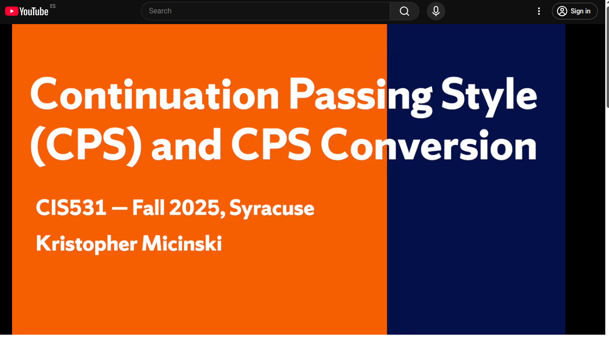

class: center, up

# CAP - Tècniques de Programació amb FOS


**Jordi Delgado**, **Gerard Escudero**,

.large[<ins>Tema 4</ins>]


---

## _Closures_: Divideix i venç


Esperem que estigui clar a hores d'ara que la capacitat de fer
servir funcions d'ordre superior ens permet treballar a nivells
d'abstracció més "_alts_" dels que podem assolir si no tenim aquesta
capacitat.

Un dels exemples més clars d'això és la possibilitat d'"_algorismitzar_" esquemes de
disseny algorísmic. Veiem com passar de l'esquema al programa amb l'esquema de **_Dividir i Vèncer_**.red[*].

_In computer science, **divide and conquer** is an **algorithm design
paradigm**. A divide-and-conquer algorithm recursively breaks down a
problem into two or more sub-problems of the same or related type,
until these become simple enough to be solved directly. The solutions
to the sub-problems are then combined to give a solution to the
original problem_.

Exemples coneguts de l'aplicació d'aquest esquema són: la cerca binària, Quicksort,
Mergesort, producte ràpid de Karatsuba, la multiplicació de matrius de Strassen, l'algorisme de
Cooley-Tukey per calcular la transformada ràpida de Fourier, etc.

Anem a veure com transformar aquest esquema, o _design paradigm_, en
un programa. Farem servir el cas més senzill, deixem com a
**exercici** la seva generalització.

.footnote[.red[*] [Font](https://en.wikipedia.org/wiki/Divide-and-conquer_algorithm)]

---

## _Closures_: Divideix i venç

Suposem que els valors sobre els que treballarem són **vectors**. I suposem també que disposem
de les següents quatre funcions: 

* `trivial`: Funció que detecta el cas trivial, o cas base, del problema
* `directe`: Acció a realitzar en el cas base.
* `dividir`: Si no estem en el cas base, cal dividir el problema en dos sub-problemes.
* `vèncer`: Acció a realitzar per composar les solucions dels subproblemes.

Aleshores, donat un problema concret sobre vectors pel que hem
definit les funcions anteriors, i l'esquema en forma de programa `dIv`
(encara per definir), el programa per resoldre el problema seria:

```Clojure
(def solució (dIv trivial directe dividir vèncer))
```
Concretem-ho amb un exemple clàssic: **Quicksort**

---

## _Closures_: Divideix i venç

Les funcions anteriors pel cas particular del _Quicksort_ podrien ser:

```Clojure
(def trivial #(< (count %) 2)) ;; vector buit o amb un sol element

(def directe identity)         ;; no cal fer res en el cas base

(defn dividir
  "vct té més d'un element"
  [vct]
  (let [[x & rstv] vct         ;; el pivot serà el primer element del vector
        menors (filter #(<= % x) rstv)
        majors (filter #(> % x)  rstv)]
    [menors,majors]))          ;; retornem les dos subvectors

(defn vèncer
  "Pel quicksort no ens importa la parella de vectors originals"
  [vct _ [sol1 sol2]]
  (concat sol1 [(first vct)] sol2))  ;; combinem solucions amb el pivot
```
Aleshores...
```Clojure
(def quicksort (dIv trivial directe dividir vèncer))

(let [s  (shuffle (range 20))]
   (println s)
   (quicksort s))
👁️ [9 6 15 3 2 4 13 5 17 7 11 1 14 12 0 16 18 10 19 8]
👉 (0 1 2 3 4 5 6 7 8 9 10 11 12 13 14 15 16 17 18 19)
```

---

## _Closures_: Divideix i venç

Finalment, com és `dIv`? Naturalment és una _closure_ on, donades les
funcions mencionades, es retorna una funció que només requereix
l'entrada del problema (en aquest cas un vector, o seqüència). Com hem
dit abans, aquest és el cas més senzill, on suposem que la
descomposició del problema és en dos subproblemes:

```Clojure
(defn dIv
  [trivial directe dividir vèncer]
  (letfn [(dIv' [vct]
            (if (trivial vct)
              (directe vct)
              (let [[x1 x2] (dividir vct)
                    y1 (dIv' x1)
                    y2 (dIv' x2)]
                (vèncer vct [x1,x2] [y1,y2]))))]
    dIv'))
```
Fixem-nos que és pràcticament una _transcripció literal_ de l'esquema de _dividir i vèncer_ 
que tots coneixem.

Aquest és un gran exemple de fins a quin punt tenir funcions d'ordre superior pot canviar la nostra
manera de programar.

---

## _Closures_: _Backtracking_

Explorem un exemple més de transformacions d'esquema algorísmic en
programa: l'esquema de **_Backtracking_** (_tornada enrera_).red[*].

Aquests algorismes, en general, són algorismes que enumeren solucions
parcials a un determinat problema, decidint si val la pena continuar
completant les solucions o no. En cas negatiu, es torna enrera a mirar
de construir noves solucions re-avaluant decisions preses
anteriorment.

És molt similar a una cerca en profunditat sobre un graf _implícit_.
Aquest graf implícit ve donat per una funció `successor`, que, donada
una solució parcial, permet generar els _veïns_ del node actual, és a
dir, solucions més completes donada la validesa de la solució parcial
que representa el node actual. El resultat és una exploració parcial
d'un _arbre implícit de cerca_, on no cal generar totes les branques
possibles (s'esporguen les que depenen de solucions parcials no
vàlides).

Apliquem-ho a un problema clàssic: **_Les $n$-reines_**. 

Recordeu: En un tauler $n \times n$ cal posar $n$ reines de manera que
no es matin entre elles.

.footnote[.red[*] [Font](https://en.wikipedia.org/wiki/Backtracking)]

---

## _Closures_: _Backtracking_

Suposem que disposem d'un programa anomenat `bTck` amb paràmetres la funció `successor` i
una funció que sigui capaç de decidir si hem trobat l'objectiu `objectiu`.
Qualsevol altre informació dependrà del problema. En particular, cal decidir com es representen
els nodes del graf implícit. Aquesta funció retorna una _closure_ que té l'estat inicial
com a paràmetre.

En el cas de les $n$-reines representarem la informació amb un vector `[col n [[c1 f1] [c2 f2]...[ck fk]]]`
on `col` representa la columna actual on volem posar la reina $k+1$-èssima, considerant que $k$ reines ja
estan ben posades, la qual cosa representem amb la solució parcial `[[c1 f1] [c2 f2]...[ck fk]]`. Les funcions
`successor`, `objectiu` i l'estat inicial dependran d'aquesta representació. Cada solució completa serà un 
vector `[n+1 n [[c1 f1] [c2 f2]...[cn fn]]]`.

Les funcions que defineixen l'estat inicial i el fet d'arribar a l'objectiu són molt senzilles:

```Clojure
(defn initialNQ [n]  ;; columna 1, solució parcial buida []
  [1 n []])

(defn objNQ [[c n psol]]  ;; acabem quan la columna a considerar c > n
  (> c n))                ;; la solució parcial psol associada és completa
```

---

## _Closures_: _Backtracking_

La funció `successor` senzillament mira de posar la reina a les diferents files de la columna `c` de 
manera que la proposta `[c f]` sigui compatible/vàlida respecte a la solució parcial `psol`. Per a això
es defineix la funció `valid` que controla què es genera a la llista per comprensió.

```Clojure
(defn succNQ [[c n psol]]  ;; donats una columna, n i una solució parcial
  (letfn [(valid [psol [c r]]
            (letfn [(test [[c' r']]
                      (and (not= (+ c' r') (+ c r))
                           (not= (- c' r') (- c r))
                           (not= r' r)))]
              (every? identity (map test psol))))]
    (for [r (range 1 (inc n)) :when (valid psol [c r])]
      [(inc c) n (conj psol [c r])])))
```

Així doncs ja podem definir les funcions que resolen el problema de les $n$-reines, donat $n$:

```Clojure
(defn solucio-NReines [n]
  (let [[[_ _ s] & cua] ((bTck succNQ objNQ) (initialNQ n))]
    s))

(defn nombre-solucions-NReines [n]
  (count ((bTck succNQ objNQ) (initialNQ n))))
```
---

## _Closures_: _Backtracking_

La funció `bTck` que representa l'esquema de _Backtracking_ és molt similar a una cerca en profunditat,
però aquest cop el graf no està explícit, i només disposem de la funció `succ`. Si ens fixem,
fem servir, un cop més, un vector com a pila (fent servir `conj`, `pop` i `peek`):

```Clojure
(defn bTck [succ obj]   ;; ja coneixeu flip i foldr, les fem servir aquí
  (letfn [(bTck' [v]
            (cond
              (empty? v)     []
              (obj (peek v)) (conj (bTck' (pop v)) (peek v))
              :else          (let [x (peek v)]
                               (recur (foldr (flip conj) (pop v) (succ x))))))]
    (fn [inicial]
      (bTck' [inicial]))))
```

Ara ja podem fer servir les funcions que resolen el problema:

```Clojure
(solucio-NReines 8) 👉 [[1 8] [2 4] [3 1] [4 3] [5 6] [6 2] [7 7] [8 5]]

(nombre-solucions-NReines 8)  👉 92
(nombre-solucions-NReines 11) 👉 2680
(nombre-solucions-NReines 12) 👉 14200 ;; a la frontera de l'StackOverflow (!)

```

---

## _Continuation-Passing Style_ (CPS)

A la [Wikipedia](https://en.wikipedia.org/wiki/Continuation-passing_style) diu:

_In functional programming, **continuation-passing style** (CPS) is a
style of programming **in which control is passed explicitly in the form
of a continuation**. This is contrasted with direct style, which is the
usual style of programming. Gerald Jay Sussman and Guy L. Steele, Jr.
coined the phrase in AI Memo 349 (1975)_

Una funció escrita en CPS requereix un paràmetre addicional: Una
**_continuació_ explícita**, que és una funció d'un paràmetre.red[*].

Les funcions en CPS <ins>_no retornen mai_</ins>. Un cop han acabat de calcular el que sigui
que calculin, <ins>_cal invocar la continuació amb aquest resultat_</ins>. Per exemple:

```Clojure
;; La funció identitat, en CPS
(defn identity-cps [x,cont]
  (cont x))
  
(identity-cps "Hola Món!", identity) 👉 "Hola Món!"
(identity-cps "Hola Món!", #(apply str (concat % " Josep"))) 👉 "Hola Món! Josep"
```
.footnote[.red[*Font]: _The Joy of Clojure_, secció 7.3.4, p. 163]

---

## _Continuation-Passing Style_: Exemples

Veiem alguns exemples una miqueta més interessants que la `identity-cps`:

El factorial:
```Clojure
(defn fact-cps [n cont]
  (if (< n 2)
    (cont 1)
    (recur (dec n) (fn [m]
                     (cont (* n m))))))

(fact-cps  5 identity) 👉 120
(fact-cps 10 identity) 👉 3628800
(fact-cps 10 #(/ % 2)) 👉 1814400
```
El coeficient binomial $\binom{n}{k} = \frac{n!}{k!(n-k)!}$
```Clojure
(defn binomial-coef-cps [n k cont]
  (fact-cps n (fn [factn]
                (fact-cps k 
                    (fn [factk]
                      (fact-cps (- n k) 
                          (fn [factnk] (cont (/ factn (* factk factnk))))))))))
                    
(binomial-coef-cps 7 4 identity) 👉 35
(binomial-coef-cps 6 3 identity) 👉 20
```
---

## _Continuation-Passing Style_: Exemples

Sigui $n$ qualsevol natural estrictament positiu. Considereu el procés
següent: Si $n$ és parell, dividiu-lo per dos. Altrament,
multipliqueu-lo per 3 i sumeu-li 1. Quan arribeu a 1, pareu.

Per exemple, començant en $n=3$, s’obté la seqüència de Collatz $S(3):
3,10,5,16,8,4,2,1$. La mida d’aquesta seqüència és 7. Des de l’any 1937 es conjectura que aquest procés acaba per a
qualsevol $n$ inicial, encara que no ho ha sabut demostrar ningú. En
aquest problema suposarem que la conjectura és certa.

Escriu una funció `mida-collatz` que, donat un natural $n > 0$, retorni
la mida de la seqüència de Collatz corresponent a $n$, és a dir, quantes
iteracions del procés descrit més amunt calen per arribar a 1.

.cols5050[
.col1[
```Clojure
(defn mida-collatz [n]
  (if (== n 1) 0
    (let [nxt (if (zero? (mod n 2)) 
                (quot n 2) 
                (inc (* 3 n)))]
      (inc (mida-collatz nxt)))))

(mida-collatz 97)  👉 118
(mida-collatz 871) 👉 178
```
]
.col2[
```Clojure
(defn mida-collatz-cps [n cont]
  (if (== n 1) (cont 0)
    (let [nxt (if (zero? (mod n 2)) 
                (quot n 2) 
                (inc (* 3 n)))]
      (recur nxt (fn [v] 
                   (cont (inc v)))))))

(mida-collatz-cps 97 identity)  👉 118
(mida-collatz-cps 871 identity) 👉 178
```
]]

---

## _Continuation-Passing Style_: Exemples

El CPS pot ser útil en cas de voler interrompre l'execució d'una funció. 

Veiem un exemple:
Suposem seqüències "_multi-nivell_" amb nombres. Per exemple: 
`'(((1)) 2 ((3 4) (5 6) ((((7)))) (((8)) 9) 10))`. Volem fer una funció que multipliqui
tots els nombres d'aquestes seqüències.

Aquesta pot ser una solució:

```Clojure
(defn producte-seq
  "s és una seqüència 'multi-nivell' de nombres, o un nombre"
  [s]
  (cond
    (number? s) s
    :else (if (empty? s) 1
              (let [[cap & cua] s
                    prod-cap    (producte-seq cap)
                    prod-cua    (producte-seq cua)]
                (* prod-cap prod-cua)))))
                
(producte-seq '(((1)) 2 ((3 4) (5 6) ((((7)))) (((8)) 9) 10))) 👉 3628800
(producte-seq '())   👉 1
(producte-seq  3 )   👉 3
(producte-seq '(10)) 👉 10
```
Si un dels nombres és `0` podríem retornar immediatament, sense procedir amb el
que queda de càlcul. Aquesta solució, però, no ho fa.

---

## _Continuation-Passing Style_: Exemples

Podem passar aquesta funció a CPS:

```Clojure
(defn producte-seq-cps
  "s és una seqüència multi-nivell de nombres, o un nombre"
  [s cont]
  (cond
    (number? s) (cont s)
    :else (if (empty? s) (cont 1)
              (let [[cap & cua] s]
                (recur cap (fn [v]
                             (producte-seq-cps cua (fn [w]
                                                     (cont (* v w))))))))))
                                                     
(producte-seq-cps '(((1)) 2 ((3 4) (5 6) ((((7)))) (((8)) 9) 10)) identity)
👉 3628800
(producte-seq-cps '() identity)   👉 1
(producte-seq-cps  3  identity)   👉 3
(producte-seq-cps '(10) identity) 👉 10
```
Aquesta funció no fa el que volem, no interromp el càlcul si troba un `0`. En canvi, en veiem
la possibilitat, ja que podem invocar la continuació `cont` original, la que
es passa en la crida a `producte-seq-cps`, en trobar un `0`, o continuar
l'execució en altre cas. En aquest cas no fem distinció...

---

## _Continuation-Passing Style_: Exemples

Hauríem de diferenciar aquestes continuacions, l'original i les que continuen el càlcul.
Per a això, fem una funció auxiliar `go`:

```Clojure
(defn producte-seq-cps
  "s és una seqüència multi-nivell de nombres, o un nombre"
  [s cont]
  (letfn [(go [s cont']
             (cond
               (number? s) (if (zero? s)
                             (cont 0)    ;; <-- Atenció
                             (cont' s))  ;; <-- Atenció
               :else (if (empty? s) (cont' 1)
                         (let [[cap & cua] s]
                           (recur cap (fn [v]
                                        (go cua (fn [w]
                                                  (cont' (* v w))))))))))]
    (go s cont)))
    
(producte-seq-cps '(((1)) 2 ((3 4) (5 6) ((((7)))) (((8)) 9) 10)) identity)
👉 3628800
```

Quan trobem un nombre, si és `0` invoquem la continuació original, la que fem
servir a la crida original a la funció `producte-seq-cps`, en altre cas invoquem
la continuació de la crida a `go`. Quan fem servir la continuació original, tot allò
que està pendent de resoldre deixa d'estar-ho, senzillament no es fa.

---

## _Continuation-Passing Style_: Exemples

Ara modifiquem les funcions per afegir un `println` cada cop que trobem un nombre:

.cols5050[
.col1[
```Clojure
(producte-seq 
   '(((1)) 2 ((3 4) (5 6) (((7))))))
👁️ 1
👁️ 2
👁️ 3
👁️ 4
👁️ 5
👁️ 6
👁️ 7
👉 5040

(producte-seq 
   '(((1)) 2 ((3 0) (5 6) (((7))))))
👁️ 1
👁️ 2
👁️ 3
👁️ 0
👁️ 5
👁️ 6
👁️ 7
👉 0
```
]
.col2[
```Clojure
(producte-seq-cps 
   '(((1)) 2 ((3 4) (5 6) (((7)))))
    identity)
👁️ 1
👁️ 2
👁️ 3
👁️ 4
👁️ 5
👁️ 6
👁️ 7
👉 5040

(producte-seq-cps 
   '(((1)) 2 ((3 0) (5 6) (((7)))))
    identity)
👁️ 1
👁️ 2
👁️ 3
👉 0
```
]]

---

## _Continuation-Passing Style_: Exemples

.cols5050[
.col1[
```Clojure
(defn fibonacci [n]
  (if (< n 2) n
    (+ (fibonacci (dec n)) 
       (fibonacci (- n 2)))))

(fibonacci 10) 👉 55
(fibonacci 40) 👉 102334155
```
]
.col2[
```Clojure
(defn fibonacci-cps [n cont]
  (if (< n 2) (cont n)
    (recur (dec n) 
       (fn [fn1] 
         (fibonacci-cps (- n 2) 
            (fn [fn2] 
              (cont (+ fn1 fn2))))))))
               
(fibonacci-cps 10 identity) 👉 55
(fibonacci-cps 40 identity)
👉 Execution error (StackOverflowError)
```
]]

Així doncs, després de veure aquests exemples la idea hauria d'estar clara: Fer
explícit el "_lloc_" on aniran a parar els resultats de tot allò que
es calcula, és a dir, en realitat **_fem explícit el flux de
control del programa_**. Allò que anomenem **_continuació_** no és més
que la funció que rebrà el resultat del que sigui que calculi la
funció en qüestió, aquella a la que se li ha passat la continuació com
a argument.

Cal fixar-se en el detall que **_en CPS totes les invocacions de la continuació sempre es
fan en tail position_**. Això és precisament perquè la continuació rep el valor final
d'allò que es vol calcular, no cal fer cap procés posterior.

---

## _Continuation-Passing Style_: _Tail Call Optimization_

Aquest estil de programar és poc llegible, farragós i per tant els
programadors _humans_ no l'acostumen a fer servir. El quid de la
qüestió, però, és que la conversió de codi _normal_ a codi en CPS es
pot programar, és a dir, automatitzar. Això fa que el CPS s'hagi fet servir
sobre tot com a representació intermèdia per a eines que han de
manipular codi de manera automàtica, p.ex. compiladors.

Malgrat tot, en Clojure tenim un problema... la relació entre CPS & TCO.red[*]:

_Every call in CPS is a tail call, and the continuation is explicitly
passed. **Using CPS without tail call optimization (TCO) will cause not
only the constructed continuation to potentially grow during
recursion, but also the call stack. This is usually undesirable**, but
has been used in interesting ways -see the Chicken Scheme compiler. As
CPS and TCO eliminate the concept of an implicit function return,
their combined use can eliminate the need for a run-time stack._

A Clojure podem resoldre-ho quan la crida és recursiva final, aleshores podem fer
servir `recur`. Tot i això, no hi ha manera d'aplicar TCO a la crida a la continuació,
i ens podem trobar amb un `StackOverflowError`.

.footnote[.red[*] [Font](https://en.wikipedia.org/wiki/Continuation-passing_style)]

---

## _Continuation-Passing Style_: Exercicis Recapitulatoris

* Feu versions CPS de `my-map`, `my-filter`, i `my-reduce`:

```Clojure
(defn my-map [f s]
  (if (empty? s) '()
      (let [[cap & cua] s]
        (cons (f cap) (my-map f cua)))))

(defn my-filter [p s]
  (if (empty? s) '()
      (let [[cap & cua] s]
        (if (p cap)
          (cons cap (my-filter p cua))
          (my-filter p cua)))))

(defn my-reduce [f x0 s]
  (if (empty? s) x0
      (let [[cap & cua] s]
        (recur f (f x0 cap) cua))))
```

fixem-nos, però, que:

```Clojure
(my-reduce     +' 0 (range 1 100000)) 👉 4999950000
(my-reduce-cps +' 0 (range 1 100000) identity) 
👉 Execution error (StackOverflowError)
```

---

## _Continuation-Passing Style_

Alguns enllaços interessants:

* [pulley.cps](https://github.com/positronic-solutions/pulley.cps)
  _is part of the pulley collection of libraries. It
  provides a source-to-source compiler for **transforming normal Clojure
  code to Clojure code in Continuation Passing Style (CPS)**, as well as
  runtime support for executing the transformed code._
  
* [Cascade](https://github.com/lilactown/cascade) _is a library of
  continuation-passing, thunk producing versions of many Clojure core
  functions. The goal is to allow essentially unbounded recursion and
  mutual recursion of seq operations. This means that the seq
  operations in this library must not use the call stack. Instead,
  **they use a combination of continuation-passing to ensure that
  operations can always be in the tail position** and trampolining to
  ensure that operations do not use the call stack._
  
* [Rama on Clojure’s terms, and the magic of continuation-passing style](https://blog.redplanetlabs.com/2024/10/10/rama-on-clojures-terms-and-the-magic-of-continuation-passing-style/)
  (10 d'octubre de 2024) Nathan Marz, Blog Red Planet Labs.

---

## _Continuation-Passing Style_

Si voleu llegir més sobre el _Continuation-Passing Style_ (però no en Clojure):

.cols5050[
.col1[


.small[[Compiling with Continuations](https://doi.org/10.1017/CBO9780511609619)]
]
.col2[


.small[[Essentials of Programming Languages 3rd.ed.](https://eopl3.com/) Una de les principals
diferències entre les tres edicions és precisament l'algorisme per transformar codi a CPS]
]
]

---

## _Continuation-Passing Style_

Finalment, podeu fer una ullada a aquest video:
**Continuation Passing Style (CPS) and CPS Conversion**,
per Kristopher Micinski (profesor a la Universitat de Syracuse, NY, EEUU),
penjat l'Octubre de 2025.

El video explica més coses de les que nosaltres hem vist (a partir del minut 17:45). Fa servir _Racket_
(variant d'Scheme), amb una sintaxi molt similar a la de Clojure. No us costarà
d'entendre.

.center[]

El podeu trobar a [www.youtube.com/watch?v=1WXnSq5k790](https://www.youtube.com/watch?v=1WXnSq5k790)

---

## Trampolins

Si alguna cosa està clara a aquestes alçades de curs és com d'important es la recursivitat en
la programació funcional, i per tant com d'important és fer alguna cosa respecte al problema
de l'`StackOverflowError`.

Si tinguéssim TCO general, el problema està resolt. Fent servir CPS podem passar qualsevol
funció a una funció on totes les invocacions a funció estan en _tail position_. Però a Clojure no tenim
TCO general.

La possibilitat de fer servir funcions d'ordre superior ens permet afrontar aquest problema
des d'un altre punt de vista: El **_trampolining_**.red[*].

A grans trets, la idea és que les funcions no retornin valors, sinò _funcions que retornen valors_.
Així no acumulem informació a la pila, a canvi de requerir, _grosso modo_, dues crides a funció
per cada crida a funció que cal fer.

Clojure té `trampoline`.red[*] ([clojuredocs.org/clojure.core/trampoline](https://clojuredocs.org/clojure.core/trampoline))

A la següent transparència veurem el codi original implementat a Clojure.

.footnote[.red[*Font]: _The Joy of Clojure_, secció 7.3.3, p. 161] 

---

## Trampolins

El codi font.red[*] de la funció Clojure (sense comentari ni metadades) és:

```Clojure
(defn trampoline
  ([f] (let [ret (f)]
         (if (fn? ret)
           (recur ret)
           ret)))
  ([f & args] (trampoline #(apply f args))))
```

Essencialment, si invoquem `trampoline` amb una funció `f` amb arguments `args` ho convertim en un _thunk_
(funció sense paràmetres) `#(apply f args)` i invoquem `trampoline` amb un sol argument, una 
funció que suposem no té paràmetres.

Si invoquem `trampoline` amb una funció `f` sense paràmetres el primer que es fa és cridar-la `(f)` i
lligar el resultat al nom `ret`. Estem suposant en aquest punt que `ret` pot ser, o bé un _thunk_, o bé
quelcom que **no** és una funció. En el primer cas tornem a invocar `trampoline`, en el segon cas retornem 
el valor.

Així doncs, no podem invocar `trampoline` amb qualsevol mena de codi, cal adaptar les funcions que
_trampolinitzem_ als requeriments de la funció `trampoline`.

.footnote[.red[*] [Línia 6370 del codi font de clojure.core](https://github.com/clojure/clojure/blob/master/src/clj/clojure/core.clj)]

---

## Trampolins

El comentari que apareix al codi font de `trampoline` és:

  "_trampoline can be used to convert algorithms requiring mutual
  recursion without stack consumption. Calls f with supplied args, if
  any. If f returns a fn, calls that fn with no arguments, and
  continues to repeat, until the return value is not a fn, then
  returns that non-fn value. Note that if you want to return a fn as a
  final value, you must wrap it in some data structure and unpack it
  after trampoline returns._"
  
Malgrat l'èmfasi que posa el comentari en la recursivitat mútua, `trampoline` pot
fer-se servir en situacions que no responen a aquesta casuística. Per exemple:

.cols5050[
.col1[
```Clojure
(defn my-reduce-cps [f x0 s cont]
  (if (empty? s) (cont x0)
      (let [[cap & cua] s]
        (recur f (f x0 cap) cua
               (fn [v]
                 (cont v))))))
(my-reduce-cps +' 0 
               (range 1 100000) 
               identity)
👉 Execution error (StackOverflowError)
```
]
.col2[
```Clojure
(defn my-reduce-cps-t [f x0 s cont]
  (if (empty? s) #(cont x0)
      (let [[cap & cua] s]
        #(my-reduce-cps-t f (f x0 cap) 
                 cua
                 (fn [v]
                   (fn [] (cont v)))))))
(trampoline my-reduce-cps-t 
            +' 0 (range 1 100000) 
            identity)
👉 4999950000
```
]]

---

## Trampolins

Veiem un altre exemple. Recordeu `foldr`?

```Clojure
(defn foldr [f val coll]
  (if (empty? coll) val
      (f (first coll) (foldr f val (rest coll)))))

(foldr +' 0 (range 1 100000))👉 Execution error (StackOverflowError)
```
No és recursiva final, però la podem convertir a recursiva final aplicant CPS:

```Clojure
(defn foldr-cps [f val coll cont]
  (if (empty? coll) (cont val)
      (recur f val (rest coll) (fn [v]
                                 (cont (f (first coll) v))))))

(foldr-cps +' 0 (range 1 100000) identity)👉 Execution error (StackOverflowError)
```

Ja vam comentar que aquest `recur` de la versió CPS no ens evita els
`StackOverflowError` ja que les crides a `cont`, malgrat estar en
_tail position_, no són optimitzades.

---

## Trampolins

Amb `trampoline` ho podem optimitzar, a canvi d'escriure una funció lleugerament diferent:

```Clojure
(defn foldr-cps-t
  [f val coll cont]
  (if (empty? coll) #(cont val)         ;; <-- Aquí cal retornar un thunk
      #(foldr-cps-t f val (rest coll)   ;; <-- Aquí també
                    (fn [v]
                      (fn [] (cont (f (first coll) v)))))))  ;; <-- Aquí també

(trampoline foldr-cps-t +' 0 (range 1 100000) identity) 👉 4999950000
```

Així, podríem redefinir `foldr`:

```Clojure
(defn foldr [f val coll]
  (letfn [(foldr-cps-t [f val coll cont]
            (if (empty? coll) #(cont val)
                #(foldr-cps-t f val (rest coll)
                              (fn [v]
                                (fn [] (cont (f (first coll) v)))))))]
    (trampoline foldr-cps-t f val coll identity)))

(foldr +' 0 (range 1 100000)) 👉 4999950000
```
---

## Trampolins

El _trampolining_, però, no és de franc. Té un cost que depén, és clar, del nombre de crides
a funció que la funció realitza. Veiem un exemple _extrem_. Recordeu la versió CPS de `fibonacci`?

```Clojure
(defn fibonacci-cps [n cont]
  (if (< n 2) (cont n)
    (recur (dec n) (fn [fn1] 
                     (fibonacci-cps (- n 2) (fn [fn2] 
                                              (cont (+ fn1 fn2))))))))
;; però...
(fibonacci-cps 40 identity) 👉 Execution error (StackOverflowError)
```
Podem redefinir la funció per fer-la adient a `trampoline`:

```Clojure
(defn fibonacci-cps-t [n cont]
  (if (< n 2) #(cont n)
      #(fibonacci-cps-t (dec n) 
         (fn [fn1] 
           (fn [] (fibonacci-cps-t (- n 2) 
                    (fn [fn2] 
                      (fn [] (cont (+ fn1 fn2))))))))))
                      
(trampoline fibonacci-cps-t 40 identity) 👉 102334155
;; però...
(time (trampoline fibonacci-cps-t 40 identity)) 👉 102334155
👁️ "Elapsed time: 44639.411517 msecs" ;; més de 44 segons !!!!
```
---

## Trampolins

El cas d'ús que s'explica a la documentació i als llibres de Clojure és quasi
sempre el de funcions mútuament recursives. Si s'escriuen de manera adequada per a `trampoline`,
com diu el comentari al codi font, no consumeixen pila.

L'exemple clàssic:

.cols5050[
.col1[
```Clojure
(defn even-or-odd? [n]
  (letfn [(my-even? [n]
            (if (zero? n) "even"
                (my-odd? (dec n))))
          (my-odd? [n]
            (if (zero? n) "odd"
                (my-even? (dec n))))]
    (my-even? n)))

(even-or-odd? 1234) 👉 "even"
(even-or-odd? 1235) 👉 "odd"
(even-or-odd? 1)    👉 "odd"
;; però...
(even-or-odd? 1000001) 
👉 Execution error (StackOverflowError)
```
]
.col2[
```Clojure
(defn even-or-odd?-t [n]
  (letfn [(my-even? [n]
            (if (zero? n) "even"
                #(my-odd? (dec n))))
          (my-odd? [n]
            (if (zero? n) "odd"
                #(my-even? (dec n))))]
    (trampoline my-even? n)))

(even-or-odd?-t 1234) 👉 "even"
(even-or-odd?-t 1235) 👉 "odd"
(even-or-odd?-t 1)    👉 "odd"
;; però...
(even-or-odd?-t 1000001) 👉 "odd"

```
]]

---

## Trampolins: Exercicis Recapitulatoris

* Donada la funció `(member? x s)`, que retorna un booleà indicant si
`x` (que no és una seqüència) està en la seqüència `s` (que pot tenir
subseqüències), feu una funció `member?-t` equivalent que no pateixi de
l'`StackOverflowError`.

```Clojure
(defn member?
  "x no és una seqüència, s és una seqüència, i pot tenir subseqüències"
  [x s]
  (if (empty? s) false
      (let [[cap & cua] s
            membre-cap  (if (seq? cap) (member? x cap) (= x cap))]
        (or membre-cap (member? x cua)))))
        
(member? 10 '(((1)) 2 ((3 0) (5 6) ((((7)))) (((8)) 9) 10))) 👉 true
(member? 4 (range 5 50000)) 👉 Execution error (StackOverflowError)

;; en canvi

(member?-t 10 '(((1)) 2 ((3 0) (5 6) ((((7)))) (((8)) 9) 10))) 👉 true
(member?-t 4 (range 5 50000)) 👉 false
(member?-t 4564328 (range 5 5000000)) 👉 true
```
---

## Trampolins: Exercicis Recapitulatoris

* Donada la funció `(my-take-while pred s)` que retorna el prefix d'`s` més gran tal
que tots els seus elements satisfan el predicat `pred`, feu una funció `(my-take-while-t pred s)`
equivalent que no tingui problemes amb la pila (no generi errors `StackOverflowError`).

```Clojure
(defn my-take-while [f s]
  (if (empty? s) '()
      (let [[cap & cua] s]
	    (if (f cap)
	      (cons cap (my-take-while f cua))
	      '()))))

(my-take-while even? [2 4 6 8 9 7 8 4]) 👉 (2 4 6 8)
(my-take-while even? [])  👉 ()
(my-take-while even? [1]) 👉 ()
(my-take-while even? [2]) 👉 (2)
(my-take-while even? [2 4 6 8 10]) 👉 (2 4 6 8 10)

;; però...

(count (my-take-while #(< % 100000) (range 1 500000))) 
👉 Execution error (StackOverflowError)

;; en canvi...

(my-take-while-t even? [2 4 6 8 9 7 8 4]) 👉 (2 4 6 8)
(count (my-take-while-t #(< % 100000) (range 1 500000))) 👉 99999

```
---

## Trampolins: Exercicis Recapitulatoris

* Volem resoldre aquest problema: _Escriure una funció_ `maxkd(m,k)` _que
retorni el nombre més gran, de mida com a molt_ `k`, _format pels digits
d' _`m` _(en el mateix ordre en que apareixen a_ `m`_)_ i tenim una solució que
funciona bé:

```Clojure
(defn maxkd [m k]
  (if (or (zero? m) (zero? k)) 0
      (let [a  (+ (mod m 10) (* 10 (maxkd (quot m 10) (dec k))))
            b  (maxkd (quot m 10) k)]
        (max a b))))
```
però volem passar-la a CPS per tenir una versió recursiva final:

```Clojure
(defn maxkd-cps [m k cont]
  (if (or (zero? m) (zero? k)) (cont 0)
      (recur (quot m 10) k
             (fn [v]
               (maxkd-cps (quot m 10) (dec k)
                          (fn [w]
                            (cont (max v (+ (mod m 10) (* 10 w))))))))))
```
.right[(continua ➡️)]

---

## Trampolins: Exercicis Recapitulatoris

El problema és el següent:

```Clojure
(maxkd 1917 2) 👉 97
(maxkd 5674329856473 10) 👉 7439856473

;; però...

(maxkd-cps 1917 2 identity) 👉 97
(maxkd-cps 5674329856473 10 identity) 👉 Execution error (StackOverflowError)
```

.small[**Exercici:** Per quina raó penseu que la versió "normal" funciona bé i en canvi
la versió CPS de seguida arriba a l'`StackOverflowError`?]

Com podríem aprofitar `maxkd-cps` per fer una versió `(maxkd-t m k)` que no provoqui
errors `StackOverflowError`?

```Clojure
(maxkd 567432985647394320009214894231 25) 👉 7985647394320009214894231N

(maxkd-cps 567432985647394320009214894231 25 identity)
👉 Execution error (StackOverflowError)

(maxkd-t 567432985647394320009214894231 25) 👉 7985647394320009214894231N
```

---

## Transducers.red[*]

Recordem (tema [2](https://jdelgadopin.github.io/cap/t2.html)) la importància que
té el `reduce` (i _familia_), ja que permet abstreure un esquema molt general de
transformació de seqüències.

La funció argument de `reduce` pot ser qualsevol funció amb signatura
`resultat, valor → resultat`. Les anomenarem _`reducing functions`_ (o funcions-_reduce_).
Exemples en són `+` o `conj`.

Ara, ja sabem que el `map` es pot expressar amb `reduce`. Si definim:

```Clojure
(defn map-reducer
  [f]
  (fn [resultat valor]
    (conj resultat (f valor))))
```

Veiem que podem fer versions _reduce_ de diversos `map`:

```Clojure
(map inc (range 10))      ≡ (reduce (map-reducer inc) [] (range 10))
(map dec (range 10))      ≡ (reduce (map-reducer dec) [] (range 10))
(map #(* % %) (range 10)) ≡ (reduce (map-reducer #(* % %)) [] (range 10))
```

.footnote[.red[*] Aquesta secció està basada en els documents
[Understanding Transducers](https://elbenshira.com/blog/understanding-transducers/) de
[Elben Shira](https://elbenshira.com) 
<br> i
[Transducers are coming](https://cognitect.com/blog/2014/8/6/transducers-are-coming)
de [Rich Hickey](https://www.linkedin.com/in/richhickey),
principalment. Això que veurem pretén ser només una introducció.]

---

## Transducers

Així doncs, donada una transformació `f` sobre cada element d'una seqüència, la funció
`map-reducer` retorna una funció-_reduce_:

```Clojure
(map-reducer f) ⇨ (fn [resultat valor] (conj resultat (f valor)))
```
.small[**Exercici**: Definir `(filter-reducer predicat)` i `(take-reducer num)` de
manera similar a com hem definit `map-reducer`. El resultat ha de ser una
funció-_reduce_]

Ara, fixem-nos que abans hem posat com a exemple de funció-_reduce_
`conj`, que és la funció-_reduce_ que fa servir `map-reducer`
(`filter-reducer` i `take-reducer` també, si heu fet l'exercici).

Podem fer-ne abstracció i fer servir _qualsevol_ funció-_reduce_:

```Clojure
(defn mapping
  [f]
  (fn [freduce]
    (fn [resultat valor]
      (freduce resultat (f valor)))))
```

I ara, `(map-reducer f) ≡ ((mapping f) conj)` on adonem-nos que `(mapping f)` rep
una funció-_reduce_ com a argument i retorna una funció-_reduce_.

Això és precisament un **_Transducer_**

---

## Transducers

Un _`transducer`_ (no ho traduirem) és una funció `T` que aplica una transformació
a una funció-_reduce_ per obtenir una nova funció-_reduce_. Si Clojure tingués tipus,
diríem que:

```Clojure
transducer T: (resultat, valor → resultat) → (resultat, valor → resultat)
```

Per poder definir _transducers_ i treballar amb ells no ens cal res especial, amb la
possibilitat de treballar amb funcions d'ordre superior és suficient.

.small[**Exercici**: Definir `(filtering predicat)` i `(taking num)` de
manera similar a com hem definit `mapping`. El resultat ha de ser un _transducer_]
<br>
_Transducers are composable algorithmic transformations. They are
independent from the context of their input and output sources and
specify only the essence of the transformation in terms of an
individual element. Because transducers are decoupled from input or
output sources, they can be used in many different processes -
collections, streams, channels, observables, etc. Transducers compose
directly, without awareness of input or creation of intermediate
aggregates._.

.tiny[[.red[Font: Referència Clojure]](https://clojure.org/reference/transducers)]

---

## Transducers

No cal que nosaltres ens programem _transducers_ com `mapping` o `filtering`.
Afortunadament moltes funcions de la [_Clojure Sequence Library_](https://clojure.org/reference/sequences)
es poden fer servir per generar _transducers_:

_The following functions produce a transducer when the input collection
is omitted: map, cat, mapcat, filter, remove, take, take-while, take-nth, drop,
drop-while, replace, partition-by, partition-all, keep, keep-indexed,
map-indexed, distinct, interpose, dedupe, and random-sample._

.tiny[[.red[Font: Referència Clojure]](https://clojure.org/reference/transducers)]

Així doncs, el nostre `(mapping f)` és equivalent a fer servir `(map f)`.

És obvi que dos _transducers_, tenint la signatura que tenen, es poden **composar**.
El resultat, és clar, és un altre _transducer_. Aixo ho fem simplement amb `comp`. Per exemple, continuant amb `map` i `filter`:

```Clojure
(def xform
  (comp
    (map inc)
    (filter even?))) 👉 #'user/xform

(reduce (xform conj) [] (range 10)) 👉 [2 4 6 8 10]
```
---

## Transducers

Preneu-vos uns minuts per pensar sobre l'exemple que acabem de posar...

```Clojure
(def xform
  (comp
    (map inc)
    (filter even?))) 👉 #'user/xform

(reduce (xform conj) [] (range 10)) 👉 [2 4 6 8 10] ;; què fa el 10 aquí?!?!
```

---

## Transducers

Preneu-vos uns minuts per pensar sobre l'exemple que acabem de posar...

```Clojure
(def xform
  (comp
    (map inc)
    (filter even?))) 👉 #'user/xform

(reduce (xform conj) [] (range 10)) 👉 [2 4 6 8 10]
```

Si enteneu perfectament per quina raó **primer** apliquem `inc` i **després**
apliquem el filtre `even?` no us cal continuar llegint...

En cas contrari mirarem de fer-vos-ho entendre... i, de pas, entendrem
per quina raó en fer servir _transducers_ no es creen resultats (col·leccions)
intermedis, i veurem que, efectivament, amb les eines que ens proporcionen les
funcions d'ordre superior en tenim prou (tal com us hem dit abans).

---

## Transducers

Tornem als nostres _transducers_ "casolans"...

```Clojure
(defn mapping
  [f]
  (fn [freduce]
    (fn [resultat valor]
      (freduce resultat (f valor)))))

(defn filtering
  [predicat]
  (fn [freduce]
    (fn [resultat valor]
      (if (predicat valor)
        (freduce resultat valor)
        resultat))))
```

i fem l'exemple que ha motivat aquesta explicació, però amb els
nostres _transducers_ equivalents:

```Clojure
(def xform
  (comp
    (mapping inc)
    (filtering even?))) 👉 #'user/xform

(reduce (xform conj) [] (range 10)) 👉 [2 4 6 8 10]
```

---

## Transducers

Ja sabem que `((comp a b) x) ≡ (a (b x))`, per tant:

```Clojure
(xform conj) ≡ ((mapping inc) ((filtering even?) conj)) ≡
```

Ara,

```Clojure
((filtering even?) conj) ≡ (fn [resultat valor]   ⇦ Anomenem F a aquesta funció 
                               (if (even? valor)
                                  (conj resultat valor)
                                  resultat))
```
i finalment:

```Clojure
(xform conj) ≡ ((mapping inc) ((filtering even?) conj)) ≡ ((mapping inc) F) ≡
(fn [resultat valor]
  (F resultat (inc valor)))
```
és a dir, *primer* apliquem `inc` al valor que toqui de la col·lecció, i
després apliquem `F` (el filtre) a aquest nou valor.
Aquesta és la funció que es fa servir al `(reduce (xform conj) [] (range 10))`

---

## Transducers

Aquest exemple també deixa clar que l'aplicació del _transducer_ es fa
als valors de la col·lecció quan es fa el corresponent recorregut
d'aquesta. Així doncs, encara que haguem composat diversos _transducers_,
_no es generen col·leccions de resultats intermedis_.

Això és essencialment el que ens deia un fragment d'una cita que hem
vist fa unes _slides_: _(...) They are
independent from the context of their input and output sources and
specify only the essence of the transformation in terms of an
individual element_.

Si invertim l'ordre en la composició, seguint amb l'exemple anterior, fixem-nos que...
```Clojure
(def xform
  (comp
    (filtering even?)
    (mapping inc))) 👉 #'user/xform

(reduce (xform conj) [] (range 10)) 👉 [1 3 5 7 9]
```

Primer es filtra i després s'incrementa.

---

## Transducers

Quan composem $N$ _transducers_, `(comp T1 T2 ... TN)` les
corresponents transformacions que fa cada _transducer_ `Ti` sobre cada
element de la seqüència es faran en l'ordre especificat en la
composició: primer `T1`, sobre el resultat s'aplicarà `T2`, etc. fins
a arribar a `TN`.

El que cal emfatitzar aquí és que `comp` **_no fa res d'especial_**
amb els _transducers_. La composició de funcions, utilitzada de la
manera _habitual_ ja ens va bé per composar _transducers_.

Hi ha diverses maneres de fer servir el _transducers_.

Clojure ens ofereix `transduce`, que fa un paper similar al `reduce`
però assumint que també es proporciona la funció-_reduce_
corresponent:

```Clojure
(transduce xform f coll)        ;; es fa servir (f) com a init
(transduce xform f init coll)
```

Per exemple:

```Clojure
(def xf (comp (filter odd?) (map inc)))

(transduce xf + (range 5))     👉 6
(transduce xf + 100 (range 5)) 👉 106
```

.tiny[[.red[Font: Referència Clojure]](https://clojure.org/reference/transducers)]

---

## Transducers

Podem _ajornar_ l'execució d'un _transducer_ sobre una seqüència fins
que es proporcioni una funció-_reduce_. Cal fer servir `eduction`. Així l'objecte
resultant es pot fer servir en lloc d'una seqüència a `reduce`:

```Clojure
(def xf (comp (filter odd?) (map inc)))

(def iter (eduction xf (range 1 6)))

(reduce + 0 iter) 👉 12     ;; on + és la funció-reduce: 0+2+4+6
;; aquesta expressió és equivalent a (reduce (xf +) 0 (range 1 6))
(reduce * 1 iter) 👉 48     ;; on * és la funció-reduce: 1*2*4*6
;; aquesta expressió és equivalent a (reduce (xf *) 1 (range 1 6))
```

Podem crear una col·lecció a partir del _transducer_, proporcionant
una seqüència i suposant _implícitament_ que la funció-_reduce_ és
`conj`. Això ho fem amb `into`:

```Clojure
(def xf (comp (filter odd?) (map inc)))

(into  [] xf (range 30)) 👉 [2 4 6 8 10 12 14 16 18 20 22 24 26 28 30]
(into '() xf (range 30)) 👉 (30 28 26 24 22 20 18 16 14 12 10 8 6 4 2)

;; són respectivament equivalents a:
;; (reduce (xf conj)  [] (range 30))
;; (reduce (xf conj) '() (range 30))
```
.tiny[[.red[Font: Referència Clojure]](https://clojure.org/reference/transducers)]

---

## Transducers

Usualment els _transducers_ són _eager_ (voraços) (els conceptes de
_lazy_ i _eager_ els veurem al tema
[6](https://jdelgadopin.github.io/cap/t6.html) ), però si volem
convertir-ho a una seqüència (que són _lazy_ per defecte) podem fer
servir `sequence`:

```Clojure
(def xf (comp (filter odd?) (map inc)))

(sequence xf (range 30)) 👉 (2 4 6 8 10 12 14 16 18 20)

(take 10 (sequence xf (iterate inc 1))) 👉 (2 4 6 8 10 12 14 16 18 20)

;; però...

(take 15 (into [] xf (iterate inc 1))) 👉  ERROR: NO ACABA

```
.tiny[[.red[Font: Referència Clojure]](https://clojure.org/reference/transducers)]

N'hi ha més a explicar sobre _transducers_. Considereu, però, el que hem vist
com una introducció.

---

## Transducers: Exercicis Recapitulatoris

* Implementeu `transduce` (sense fer servir el `transduce` de Clojure,
  és clar!).

* Implementeu `taking`, exercici de la plana [35](https://jdelgadopin.github.io/cap/t4.html#35)
  (sense fer servir `take`, és clar)
   
* Implementeu `mapcatting`, versió _transducer_ del
  `mapcat` de Clojure (sense fer servir `mapcat`, és clar)

